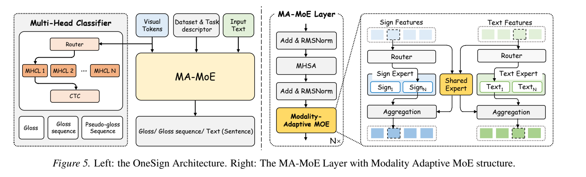
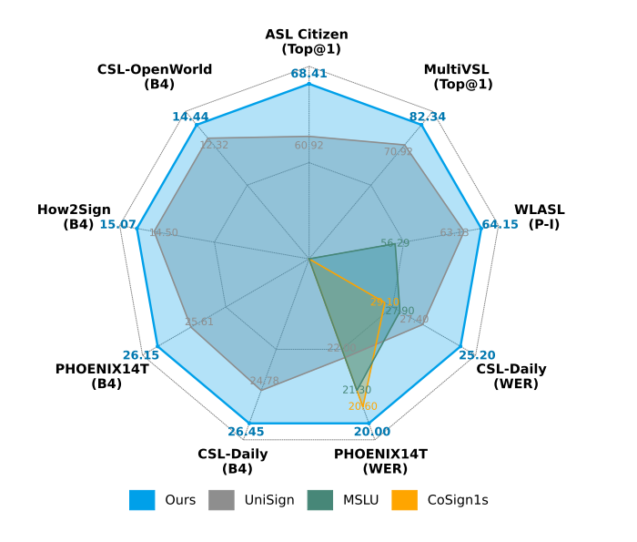
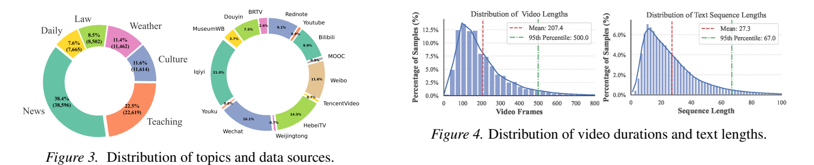
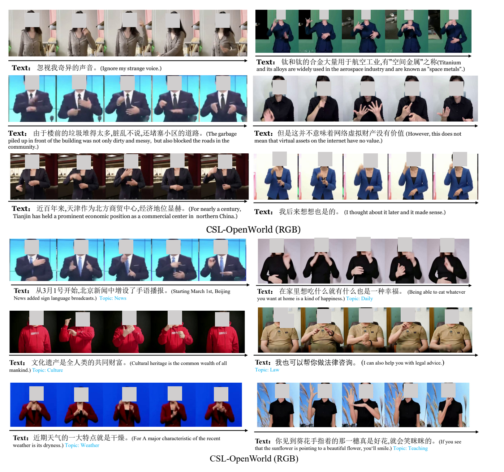

<h1 align="center">OneSign</h1>

<h3 align="center">Unifying Sign Language Understanding Tasks with One Model</h3>

<p align="center">
  <b>Shiwei Gan</b> · Yafeng Yin · Xiao Liu · Desibieer Tuerdaken · Lei Xie · Sanglu Lu<br>
  State Key Laboratory of Novel Software Technology, Nanjing University
</p>

<p align="center">
  <a href="paper/onesign.pdf"></a>
  <a href="https://huggingface.co/datasets/hulala/CSL-OpenWorld-pose"></a>
  
</p>

<p align="center">
  <a href="#overview">Overview</a> ·
  <a href="#highlights">Highlights</a> ·
  <a href="#results-at-a-glance">Results</a> ·
  <a href="#csl-openworld">Dataset</a> ·
  <a href="#roadmap">Roadmap</a> ·
  <a href="#citation">Citation</a>
</p>

---

## Overview

**OneSign** is a unified framework for Sign Language Understanding (SLU). It
reformulates **Isolated Sign Language Recognition (ISLR)**, **Continuous Sign
Language Recognition (CSLR)**, and **Sign Language Translation (SLT)** under a
single training and inference paradigm. One model and one checkpoint support
all tasks without task- or dataset-specific retraining.

To bridge the distributional gap between continuous sign representations and
discrete text tokens, OneSign introduces a **Modality-Adaptive
Mixture-of-Experts (MA-MoE)** architecture. An always-activated shared expert
captures modality-invariant semantics, while sparse sign-specific and
text-specific experts learn the characteristics of each modality.

<p align="center">
  
</p>

## Highlights

- **One model, multiple tasks.** ISLR, CSLR, gloss-based SLT, and gloss-free
  SLT are jointly trained and directly inferred from a single checkpoint.
- **Modality-Adaptive MoE.** Shared and modality-specific experts explicitly
  model the heterogeneity between sign and text tokens.
- **Heterogeneous multi-dataset learning.** Multi-Head Classifier Layers
  stabilize visual representation learning across datasets with different gloss
  vocabularies.
- **Efficient pose-based modeling.** Dynamic Part Graph Fusion captures
  interactions among torso, face, left-hand, and right-hand pose features.
- **CSL-OpenWorld.** A new 100K+ sample open-domain Chinese Sign Language
  dataset covering diverse signers, backgrounds, sources, and topics.

## Results at a Glance

OneSign is jointly trained on heterogeneous datasets and evaluated directly on
each benchmark **without dataset-specific fine-tuning**.

<p align="center">
  
</p>

### Isolated Sign Language Recognition

| Dataset | Metric | OneSign |
|:--|:--:|--:|
| ASL Citizen | Top-1 ↑ | **68.41** |
| WLASL2000 | Per-instance Top-1 ↑ | **64.15** |
| MultiVSL1000 | Top-1 ↑ | **82.34** |

### Continuous Recognition and Translation

| Task | Dataset | Metric | Dev | Test |
|:--|:--|:--:|--:|--:|
| CSLR | CSL-Daily | WER ↓ | **25.20** | **25.70** |
| CSLR | PHOENIX14T | WER ↓ | **20.00** | **20.10** |
| SLT | CSL-Daily | BLEU-4 ↑ | **25.28** | **26.15** |
| SLT | PHOENIX14T | BLEU-4 ↑ | **26.98** | **26.45** |
| Gloss-free SLT | How2Sign | BLEU-4 ↑ | **15.41** | **15.07** |
| Gloss-free SLT | CSL-OpenWorld | BLEU-4 ↑ | **14.71** | **14.44** |

## CSL-OpenWorld

We introduce **CSL-OpenWorld**, a large-scale web-sourced dataset for
open-domain Chinese Sign Language Translation. It substantially expands the
scale, vocabulary, and environmental diversity of existing CSL benchmarks.

| Samples | Training samples | Vocabulary | Duration | Source | Domain |
|--:|--:|--:|--:|:--:|:--:|
| **100K+** | **86K+** | **12K** | **216 h** | Web | Multi-topic |

<p align="center">
  
</p>

The dataset covers news, teaching, culture, weather, law, and daily-life content
from a broad range of online platforms. It includes large variations in camera
viewpoint, signing style, background, and recording conditions.

<details>
<summary><b>View more CSL-OpenWorld samples</b></summary>
<br>
<p align="center">
  
</p>
<p><i>Facial regions are blurred for privacy, following the paper.</i></p>
</details>

### Dataset Access

The pose dataset, access agreement, and citation instructions are available on
Hugging Face:

- [CSL-OpenWorld-pose](https://huggingface.co/datasets/hulala/CSL-OpenWorld-pose)
- [SignDataset collection](https://huggingface.co/collections/hulala/signdataset)

CSL-OpenWorld is released for academic, non-profit research under its own
agreement. Please read and sign the current agreement before requesting access.
The dataset, annotations, and derived files must **not** be redistributed.

## Roadmap

- [x] Release paper
- [x] Release CSL-OpenWorld access page
- [ ] Release training and inference code
- [ ] Release pretrained checkpoints
- [ ] Release data preprocessing instructions
- [ ] Release evaluation scripts

## Citation

If you find OneSign or CSL-OpenWorld useful in your research, please cite:

```bibtex
@article{gan2026onesign,
  title     = {OneSign: Unifying Sign Language Understanding Tasks with One Model},
  author    = {Gan, Shiwei and Yin, Yafeng and Liu, Xiao and Tuerdaken, Desibieer and
               Jiang, Zhiwei and Xie, Lei and Lu, Sanglu},
  year      = {2026},
  publisher = {arXiv}
}
```

## Acknowledgement

This work uses the CSL-OpenWorld dataset collected and curated by Intelligent
Sensing and Visual Computing / Nanjing University.

---

<p align="center">If you find this project useful, please consider giving it a ⭐.</p>
